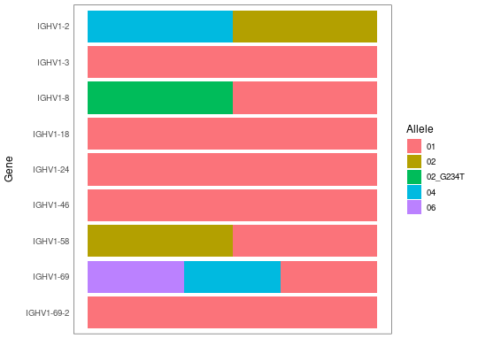
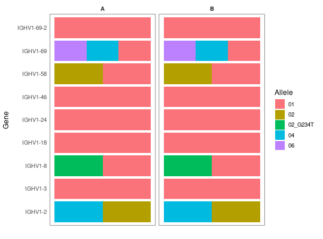

**plotGenotype** - *Show a colorful representation of a genotype*

Description
--------------------

`plotGenotype` plots a genotype table.


Usage
--------------------
```
plotGenotype(genotype, facet_by = NULL, gene_sort = c("name",
"position"), text_size = 12, silent = FALSE, ...)
```

Arguments
-------------------

genotype
:   a `data.frame` of alleles denoting a genotype, 
as returned by [inferGenotype](inferGenotype.md).

facet_by
:   a column name in `genotype` to facet the plot by. 
If `NULL`, then do not facet the plot.

gene_sort
:   a string defining the method to use when sorting alleles.
If `"name"` then sort in lexicographic order. If
`"position"` then sort by position in the locus, as
determined by the final two numbers in the gene name.

text_size
:   the point size of the plotted text.

silent
:   if `TRUE` do not draw the plot and just return the ggplot
object; if `FALSE` draw the plot.

...
:   additional arguments to pass to ggplot2::theme.


Value
-------------------

A ggplot object defining the plot.


Examples
-------------------

```R
# Plot genotype
plotGenotype(SampleGenotype)

```



```R

# Facet by subject
genotype_a <- genotype_b <- SampleGenotype
genotype_a$SUBJECT <- "A"
genotype_b$SUBJECT <- "B"
geno_sub <- rbind(genotype_a, genotype_b)
plotGenotype(geno_sub, facet_by="SUBJECT", gene_sort="pos")
```




See also
-------------------

[inferGenotype](inferGenotype.md)


