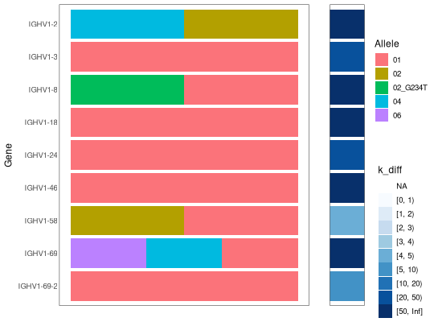

**plotGenotypeConfidence** - *Show a genotype with a confidence evidence panel*

Description
--------------------

`plotGenotypeConfidence` draws a genotype with [plotGenotype](plotGenotype.md) and adds a
color panel beside it showing a per-gene confidence value, such as the `k_diff`
produced by [inferGenotypeBayesian](inferGenotypeBayesian.md).


Usage
--------------------
```
plotGenotypeConfidence(
genotype,
confidence_col,
allele_col = "alleles",
gene_sort = c("name", "position"),
text_size = 12,
confidence_breaks = c(0, 1, 2, 3, 4, 5, 10, 20, 50, Inf),
silent = FALSE,
...
)
```

Arguments
-------------------

genotype
:   `data.frame` of alleles denoting a genotype, as
returned by [inferGenotypeBayesian](inferGenotypeBayesian.md).

confidence_col
:   name of the column in `genotype` holding the per-gene
confidence value, e.g. `"k_diff"`. The value is binned and
shown on a blue color scale, with the column name as the legend
title; white marks genes with no value.

allele_col
:   name of the column in `genotype` holding the alleles to
plot, passed to [plotGenotype](plotGenotype.md). Set to
`"genotyped_alleles"` to plot the most likely alleles.

gene_sort
:   string defining the method to use when sorting alleles, passed
to [plotGenotype](plotGenotype.md).

text_size
:   point size of the plotted text.

confidence_breaks
:   numeric vector of breaks used to bin the confidence
value into color groups. The default
`c(0, 1, 2, 3, 4, 5, 10, 20, 50, Inf)` matches the binning
used by RAbHIT for the haplotype lK panel.

silent
:   if `TRUE` do not draw the plot and just return the grob;
if `FALSE` draw the plot.

...
:   additional arguments to pass to ggplot2::theme of the
genotype panel.


Value
-------------------

A `gridExtra` grob combining the genotype plot with the confidence panel.


Examples
-------------------

```R
# The Bayesian genotype carries a per-gene confidence (k_diff) and, optionally,
# a genotyped_alleles column
geno_bayesian <- inferGenotypeBayesian(AIRRDb, germline_db=SampleGermlineIGHV,
novel=SampleNovel, genotyped_alleles=TRUE)
plotGenotypeConfidence(geno_bayesian, confidence_col="k_diff",
allele_col="genotyped_alleles")

```




See also
-------------------

[plotGenotype](plotGenotype.md), [inferGenotypeBayesian](inferGenotypeBayesian.md)


