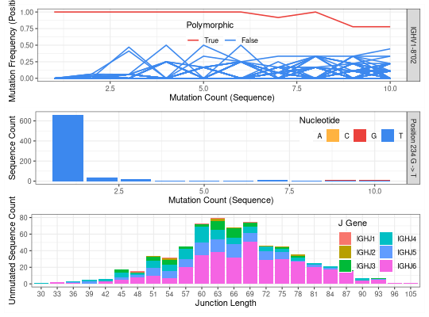

**plotNovel** - *Visualize evidence of novel V alleles*

Description
--------------------

`plotNovel` is be used to visualize the evidence of any novel V
alleles found using [findNovelAlleles](findNovelAlleles.md). It can also be used to
visualize the results for alleles that did


Usage
--------------------
```
plotNovel(
data,
novel_row,
v_call = "v_call",
j_call = "j_call",
seq = "sequence_alignment",
junction = "junction",
junction_length = "junction_length",
pos_range_max = NULL,
ncol = 1,
multiplot = TRUE
)
```

Arguments
-------------------

data
:   `data.frame` containing repertoire data. See
[findNovelAlleles](findNovelAlleles.md) for details.

novel_row
:   single row from a data frame as output by
[findNovelAlleles](findNovelAlleles.md) that contains a
polymorphism-containing germline allele.

v_call
:   name of the column in `data` with V allele
calls. Default is `v_call`.

j_call
:   name of the column in `data` with J allele calls. 
Default is `j_call`.

seq
:   name of the column in `data` with the 
aligned, IMGT-numbered, V(D)J nucleotide sequence.
Default is `sequence_alignment`.

junction
:   Junction region nucleotide sequence, which includes
the CDR3 and the two flanking conserved codons. Default
is `junction`.

junction_length
:   number of junction nucleotides in the junction sequence.
Default is `junction_length`.

pos_range_max
:   Name of the column in `data` with the ending
positions of the V alignment in the germline 
(usually `v_germline_end`).

ncol
:   number of columns to use when laying out the plots.

multiplot
:   whether to return one single plot (`TRUE`) or a list 
with the three individual plots (`FALSE`).


Details
-------------------

The first panel in the plot shows, for all sequences which align to a particular 
germline allele, the mutation frequency at each postion along the aligned 
sequence as a function of the sequence-wide mutation count. Each line is a position.
Positions that contain polymorphisms (rather than somatic hypermutations) 
will exhibit a high apparent mutation frequency for a range of 
sequence-wide mutation counts. The positions are color coded as follows:


+ red:    the position(s) pass(ess) the novel allele test 
+ yellow: the position(s) pass(ess) the y-intercept test but not
other tests
+ blue:   the position(s) didn't pass the y-intercept test and 
was(were) not further considered

 
The second panel shows the nucleotide usage at each of the polymorphic positions
as a function of sequence-wide mutation count. If no polymorphisms were identified,
the panel will show the mutation count.

To avoid cases where a clonal expansion might lead to a false positive, TIgGER examines
the combinations of J gene and junction length among sequences which perfectly 
match the proposed germline allele. Clonally related sequences usually share 
the same V gene, J gene and junction length. Requiring the novel allele
to be found in different combinations of J gene and junction lengths
is a proxy for requiring it to be found in different clonal lineages.


Examples
-------------------

```R
# Plot the evidence for the first (and only) novel allele in the example data
novel <- selectNovel(SampleNovel)
plotNovel(AIRRDb, novel[1, ], v_call="v_call", j_call="j_call", 
seq="sequence_alignment", junction="junction", junction_length="junction_length", 
multiplot=TRUE)
```




