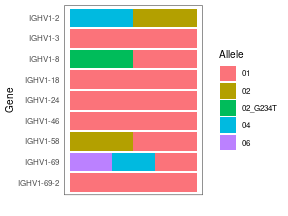

# Polymorphism detection and genotyping

## Introduction 

Adapative immune receptor repertoire sequencing (AIRR-Seq, Rep-Seq) data is 
currently the subject of much study. A key step in analyzing these data involves 
assigning the closest known V(D)J germline alleles to the (often somatically mutated) 
sample sequences using a tool such as IMGT/HighV-QUEST ([[1]][1]). However, 
if the sample utilizes alleles not in the germline database used for alignment, 
this step will fail. Additionally, this alignment has an associated error rate 
of ~5% ([[2]][2]), notably among sequences carrying a large number of somatic 
mutations.

Here we provide a **T**ool for **I**mmuno**g**lobulin **G**enotype 
**E**lucidation via **R**ep-Seq (TIgGER). TIgGER addresses these issues by 
inferring the set of Immunoglobulin (Ig) alleles carried by an individual 
(including any novel alleles) and then using this set of alleles to correct 
the initial assignments given to sample sequences by existing tools. 

This vignette covers the following tasks:

1. Inferring the presence of novel IGHV alleles not in the germline database.
2. Inferring the personalized IGHV genotype of a sample.
3. Correcting the IGHV allele calls of a sample based on the IGHV genotype.

Additional information about the methods used by TIgGER is available in:

[Gadala-Maria D, Yaari G, Uduman M, Kleinstein SH (2015) Automated analysis of 
high-throughput B cell sequencing data reveals a high frequency of novel 
immunoglobulin V gene segment alleles. *PNAS* 
112(8):E862-70](http://www.pnas.org/content/early/2015/02/05/1417683112).

## Input

TIgGER requires two main inputs:

1. Pre-processed Ig sequence data
2. Database germline sequences

AIRR-seq data is input as a data frame following the AIRR or Change-O standard where 
each row represents a unique observation and and columns represent data about 
that observation. The required names of the required columns are provided below 
along with a description of each.

Column Name                                 | Description 
--------------------------------------------|---------------------------------------------------------
`SEQUENCE_IMGT` or `sequence_alignment`     | V(D)J sequence gapped in the IMGT gapped format ([[3]][3])
`V_CALL` or `v_call`                        | (Comma separated) name(s) of the nearest V allele(s) 
`J_CALL` or `j_call`                        | (Comma separated) name(s) of the nearest J allele(s) 
`JUNCTION` or `junction`                    | Junction nucleotide sequence
`JUNCTION_LENGTH` or `junction_length`      | Length of the junction region of the V(D)J sample

An example dataset is provided with the `tigger` package as `SampleDb` (Change-O format)
and `airrDb` (AIRR format). It contains unique functional sequences assigned to IGHV1 family genes isolated from individual PGP1 (referenced in Gadala-Maria *et al.* 2015).

The database of germline sequences should be provided in FASTA format with 
sequences gapped according to the IMGT numbering scheme ([[3]][3]). IGHV alleles in
the IMGT database (build 201408-4) are provided with this package as `SampleGermlineIGHV`. 
You may read in your own fasta file using `readIgFasta`.


```r
# Load packages required for this example
library(tigger)
library(dplyr)
```

## Novel allele detection

Potential novel alleles can be detected by TIgGER. Some of these may be included
in the genotype later (see below). `findNovelAlleles` will return a `data.frame`
with a row for each allele tested for the presence of polymorphisms. If
polymorphisms are found and the novel sequence passes all quality tests (see
below), then the novel allele is named and the germline sequence is included in
the `data.frame`. Additionally, the result will contain metadata on the 
parameters used when searching for novel alleles (which can be optionally
changed in `findNovelAlleles`).


```r
# Detect novel alleles
novel <- findNovelAlleles(airrDb, SampleGermlineIGHV, nproc=1)
```


```r
# Extract and view the rows that contain successful novel allele calls
novel_rows <- selectNovel(novel)
```

The TIgGER procedure for identifying novel alleles (see citation above) involves
taking all sequences which align to a particular germline allele and, for each 
position along the aligned sequences, plotting the mutation frequency at that 
postion as a function of the sequence-wide mutation count. While mutational 
hot-spots and cold-spots are both expected to have a *y*-intercept around zero, 
polymorphic positions will have a *y*-intercept larger than zero. The required 
minimum *y*-intercept may be specified in `findNovelAlleles` by `y_intercept`, but 
defaults to `1/8`. Passing this *y*-intercept threshold is the first of three 
pieces of evidence that support the novel allele.

The second piece of evidence supporting novel allele calls is the nucleotide
usage at the polymorphic positions as a function of sequence-wide mutation
count. We expect the polymorphic allele to be prevalent at all mutation counts,
and we expect the mutation count equal to the number of polymorphisms in the
novel sequence to be the most prevalent.

Finally, to avoid cases where a clonal expansion might lead to a false positive,
combinations of J gene and junction length are examined among sequences which 
*perfectly match* the proposed germline allele. A true novel allele is expected 
to utilize a wide range of J genes, and sequences with different junction length
can be ruled out as not being clonally related. The maximum portion of sequences
which can consist of a specific combination of J gene and junction length may be
specified in `findNovelAlleles` by `j_max`.

The three pieces of evidence desribed above can be viewed for any allele call
made by `findNovelAlleles` using the function `plotNovel`.


```r
# Plot evidence of the first (and only) novel allele from the example data
novel_row <- which(!is.na(novel$polymorphism_call))[1]
plotNovel(airrDb, novel[novel_row, ])
```


## Inferring genotypes

An individual's genotype can be inferred using the functions `inferGenotype` or 
`inferGenotypeBayesian`. Using one of this functions allows to remove from the
genotype rare/erroneous allele calls which may result from mutations in 
allele-differentiating regions. `inferGenotype` uses a frequency method to 
decide which alleles belong to the subjects genotype whereas 
`inferGenotypeBayesian` infers an subject's genotype applying a Bayesian 
framework and provides a confidence estimate associated with 
the genotype calls.


### Frequency genotyping approach

`inferGenotype` identifies the fewest alleles that account for 
nearly all (default is 7/8) of the allele calls made. The user may opt to only
use sequences which perfectly match germline alleles, and may opt to include 
potential novel alleles. (The genotype output is designed to be human readable, 
though `plotGenotype` can be used to make a colorful visualization.) For each 
allele, the number of sequences which  match the germline are listed in the same
order as the alleles are listed. The total number of sequences that match any 
allele of that gene is also given. To output these alleles as a names vector of 
nucleotide sequences, the user may use the function `genotypeFasta`. To save 
this vector to a fasta file, `writeFasta` may be used.


```r
# Infer the individual's genotype, using only unmutated sequences and checking
# for the use of the novel alleles inferred in the earlier step.
geno <- inferGenotype(airrDb, germline_db=SampleGermlineIGHV, novel=novel,
                      find_unmutated=TRUE)
# Save the genotype sequences to a vector
genotype_db <- genotypeFasta(geno, SampleGermlineIGHV, novel)
# Visualize the genotype and sequence counts
print(geno)
```

```
##         gene     alleles      counts total note
## 1    IGHV1-2       02,04     664,302   966     
## 2    IGHV1-3          01         226   226     
## 3    IGHV1-8 01,02_G234T     467,370   837     
## 4   IGHV1-18          01        1005  1005     
## 5   IGHV1-24          01         105   105     
## 6   IGHV1-46          01         624   624     
## 7   IGHV1-58       01,02       23,18    41     
## 8   IGHV1-69    01,04,06 515,469,280  1279     
## 9 IGHV1-69-2          01          31    31
```

```r
# Make a colorful visualization. Bars indicate presence, not proportion.
plotGenotype(geno, text_size = 10)
```



### Bayesian genotyping approach

The method `inferGenotypeBayesian` analyzes the posterior probabilities of 
possible allele distributions, considering up to four distinct alleles per 
V gene, corresponding to a gene duplication with both loci being heterozygous 
(i.e., homozygous, heterozygous with one copy of each allele, etc.). The 
posterior probabilities for these four possible models are compared and a Bayes
factor is calculated for the two most probable models. This Bayes factor 
reflects the confidence in the genotyping call of the method. The bayesian 
method doesn't use the strict cutoff criterion `fraction_to_explain` that 
`inferGenotype` uses wherein only the minimum set of alleles explaining 
88% (7/8) of apparently-unmutated sequences are included in the genotype.


```r
# Infer the individual's genotype, using the bayesian method
geno_bayesian <- inferGenotypeBayesian(airrDb, germline_db=SampleGermlineIGHV, 
                                       novel=novel, find_unmutated=TRUE)
# Visualize the genotype and sequence counts
print(geno_bayesian)
```

```
##         gene     alleles         counts total note                kh
## 1    IGHV1-2       02,04        664,302   966                  -1000
## 2    IGHV1-3          01            226   226       4.20089197988625
## 3    IGHV1-8 01,02_G234T        467,370   837                  -1000
## 4   IGHV1-18          01           1005  1005      -3.76643736033536
## 5   IGHV1-24          01            105   105       4.75335701924247
## 6   IGHV1-46          01            624   624      0.457455409315221
## 7   IGHV1-58       01,02          23,18    41      -20.3932114156223
## 8   IGHV1-69 01,04,06,02 515,469,280,15  1279                  -1000
## 9 IGHV1-69-2          01             31    31       4.16107190423977
##                  kd                kt                kq           k_diff
## 1 -7.92846809405969 -139.556367176944 -313.583949130729 131.627899082884
## 2 -45.2911957825576 -84.2865868763307 -128.991761853586 49.4920877624439
## 3 -1.04759115960507 -102.524664723923 -247.193958844361 101.477073564318
## 4  -223.85293382607             -1000             -1000 220.086496465735
## 5 -18.2407545518045 -36.3580822723628 -57.1281856909991 22.9941115710469
## 6 -136.193264784335 -243.861955237939             -1000  136.65072019365
## 7  3.60009261357983 -1.38512929425796 -8.47869574581951  4.9852219078378
## 8 -277.291087469703  3.55051520054669 -143.380669247128 146.931184447674
## 9 -2.62766579768837 -7.97659112471034 -14.1087168959268 6.78873770192814
```

```r
# Make a colorful visualization. Bars indicate presence, not proportion.
plotGenotype(geno_bayesian, text_size=10)
```


## Correcting allele calls

Finally, the original V allele calls may be limited to only those within the 
inferred genotype. This can be done by using the function `reassignAlleles`.
By correcting the calls in this manner, the user can greatly reduce the numer of
ambiguous allele calls (where a single sample sequences is assigned to multiple
V alleles, thus preventing the mutations analysis of allele-differentiating
positions). Additionally, assignments to erroneous not-in-genotype alleles
(expected to be ~5% ([[2]][2]), as mentioned above, are corrected in this manner.


```r
# Use the personlized genotype to determine corrected allele assignments
# Updated genotype will be placed in the v_call_genotyped column
sample_db <- reassignAlleles(airrDb, genotype_db)
```

From here, one may proceed with further downstream analyses, but with the
advantage of having much-improved allele calls. Besides having discovered
alleles not in the IMGT database, the calls made by IMGT have been tailored to
the subject's genotype, greatly reducing the number of problematic calls, as
can be seen below.


```r
# Find the set of alleles in the original calls that were not in the genotype
not_in_genotype <- sample_db$v_call %>%
    strsplit(",") %>%
    unlist() %>%
    unique() %>%
    setdiff(names(genotype_db))

# Determine the fraction of calls that were ambigious before/after correction
# and the fraction that contained original calls to non-genotype alleles. Note
# that by design, only genotype alleles are allowed in "after" calls.
data.frame(Ambiguous=c(mean(grepl(",", sample_db$v_call)),
                       mean(grepl(",", sample_db$v_call_genotyped))),
           NotInGenotype=c(mean(sample_db$v_call %in% not_in_genotype),
                           mean(sample_db$v_call_genotyped %in% not_in_genotype)),
           row.names=c("Before", "After")) %>% 
    t() %>% round(3)
```

```
##               Before After
## Ambiguous      0.112 0.006
## NotInGenotype  0.057 0.000
```

## Evidence 

`generateEvidence` uses the final corrected calls, the novel alleles and genotype 
information, the final genotype sequences and the starting reference germlines
to build a table of evidence metrics supporting the final novel V allele detection.


```r
evidence <- generateEvidence(sample_db, novel, geno, genotype_db, SampleGermlineIGHV, fields = NULL)

evidence %>%
  select(gene, allele, polymorphism_call, sequences, unmutated_frequency)
```

```
## Source: local data frame [1 x 5]
## Groups: <by row>
## 
## # A tibble: 1 x 5
##   gene    allele   polymorphism_call sequences unmutated_frequency
##   <chr>   <chr>    <chr>                 <int>               <dbl>
## 1 IGHV1-8 02_G234T IGHV1-8*02_G234T        864               0.428
```

In this example, 864 sequences were unambiguously assigned
to allele IGHV1-8*02_G234T, 
42.82%
of them unmutated.

## References

1. [Alamyar *et al.* (2010)](http://www.imgt.org/IMGTindex/IMGTHighV-QUEST.html)
2. [Munshaw and Kepler (2010)](http://www.ncbi.nlm.nih.gov/pubmed/20147303)
3. [Lefranc *et al.* (2003)](http://www.ncbi.nlm.nih.gov/pubmed/12477501)

[1]: http://www.imgt.org/IMGTindex/IMGTHighV-QUEST.html "Alamyar et al. (2010)" 
[2]: http://www.ncbi.nlm.nih.gov/pubmed/20147303 "Munshaw and Kepler (2010)" 
[3]: http://www.ncbi.nlm.nih.gov/pubmed/12477501 "Lefranc et al. (2003)"

